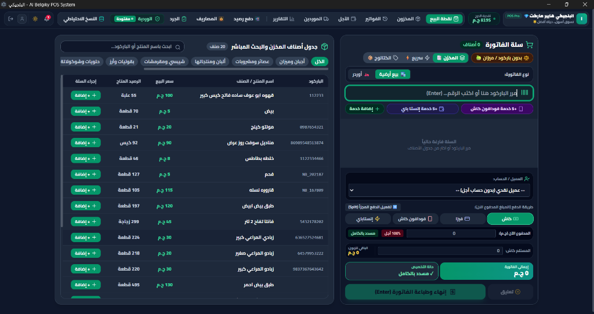
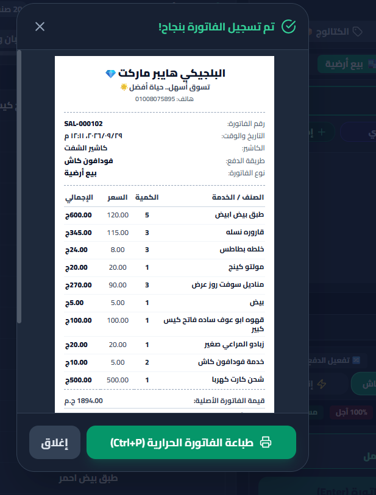
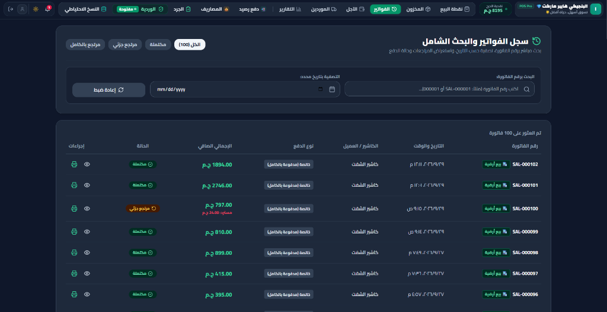
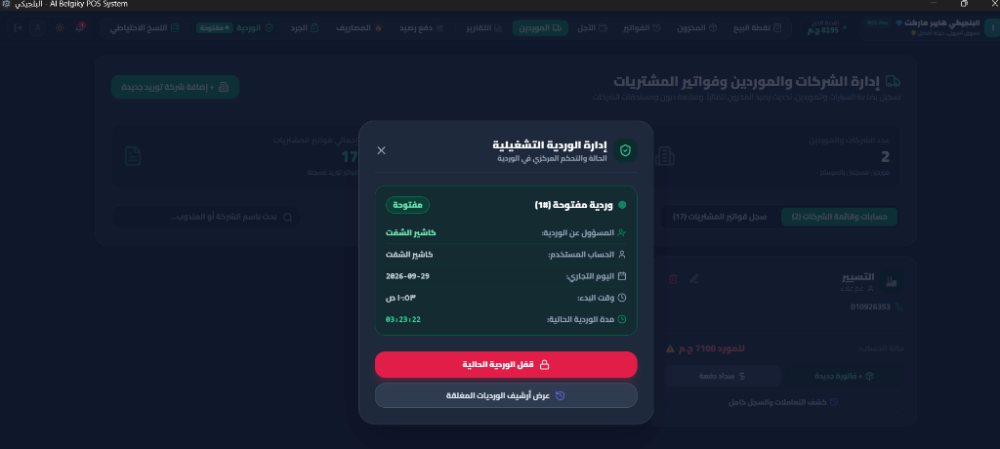

# ZAAD POS — Retail Management & Point of Sale System

> A modern, high-performance desktop point-of-sale and retail management system engineered for supermarkets, hypermarkets, and modern retail operations.

[](https://zaadsystem.com)
[](https://zaadsystem.com)
[](https://zaadsystem.com)
[](https://zaadsystem.com)
[](https://zaadsystem.com)

---

## 🌐 Live Product Website

- **Production Domain**: [https://zaadsystem.com](https://zaadsystem.com) *(Deployment Pending via Cloudflare Pages)*
- **Privacy Policy**: [https://zaadsystem.com/privacy/](https://zaadsystem.com/privacy/)
- **Terms of Service**: [https://zaadsystem.com/terms/](https://zaadsystem.com/terms/)

---

## 📸 Production Interface Showcase

| Cashier Point of Sale Checkout | Operational Thermal Receipt |
| :---: | :---: |
|  |  |

| Comprehensive Invoice Register | Operative Shift Control |
| :---: | :---: |
|  |  |

---

## ⚡ Key Business Capabilities

- **Point of Sale (POS)**: Rapid barcode scanning, product catalog search, split billing (Cash, Vodafone Cash, InstaPay, Visa, Credit), and instant thermal receipt printing.
- **Inventory Management**: Real-time stock deduction, movement history, category management, low-stock warnings, and barcode printing.
- **Purchases & Suppliers**: Supplier account ledgers, purchasing records, payment tracking, and supplier debt management.
- **Customer Credit & Debt**: Debt account tracking, partial payment collection, customer credit limits, and debt receipts.
- **Operational Expenses**: Utility bills, store expenses, maintenance logs, and petty cash tracking.
- **Guided Inventory Count**: Physical stock audit tools with stock variance calculation and controlled adjustment posting.
- **Shift Management**: Structured cashier shift opening/closing, active drawer float monitoring, and shift duration records.
- **Daily Z Financial Reporting**: Authoritative business-day financial summaries with payment channel breakdown and net profit analysis.
- **Local Backup & Restore**: SQLite database snapshots and controlled restoration workflows to prevent data loss.
- **Automated Email Reports**: Optional automated Daily Z PDF report delivery directly to store owner emails via Google OAuth 2.0.
- **Role Permissions**: Restricted cashier access, manager authorizations, and audit logging.

---

## 🏗️ System Architecture Overview

```
[ Desktop POS Application ]
   Renderer Process (React 18 + Vite + Tailwind CSS)
          │
   Preload Context Bridge (Secure IPC Layer)
          │
   Main Process Services (Electron)
          │
   Embedded SQLite Database (better-sqlite3)

[ Commercial Web Platform ]
   Static Site Engine (HTML5 / Vanilla CSS / i18n Engine)
          │
   Cloudflare Pages Edge CDN
          │
   zaadsystem.com (Production Domain)
```

---

## 🔒 Security, Privacy & Local Sovereignty

1. **Local Data Sovereignty**: All operational store data (sales, inventory, customers, supplier accounts) is stored locally on the retail store's computer in a high-performance SQLite database.
2. **Optional Gmail Report Delivery**: Google OAuth 2.0 scope (`https://www.googleapis.com/auth/gmail.send`) is used strictly to deliver automated Daily Z PDF reports on behalf of the store owner.
3. **Zero Inbox Access**: The application never reads, scans, stores, or processes user inbox messages or incoming emails.
4. **Clean Source Control**: All local databases, customer records, credentials, and `.env` files are strictly excluded from source control.

---

## 📁 Repository Structure

```
zaad-website/
├── index.html            # Commercial Homepage & Showcase
├── _headers              # Cloudflare Pages Security & Caching Rules
├── .gitignore            # Version Control Exclusion Rules
├── README.md             # Repository Documentation & Overview
├── serve.cjs             # Local Preview HTTP Server Script
├── privacy/
│   └── index.html        # Google OAuth Verification Ready Privacy Policy
├── terms/
│   └── index.html        # Official Terms of Service & License
└── assets/
    ├── css/
    │   └── styles.css    # Responsive Styling & Theme System
    ├── js/
    │   ├── i18n.js       # Internationalization Engine (AR | EN)
    │   └── main.js       # Interactive UI & Lightbox Scripts
    └── screenshots/      # Production Software Screenshots
```

---

## 🚀 Cloudflare Pages Deployment Workflow

This repository is configured for automated deployment via Cloudflare Pages:

- **Production Branch**: `main`
- **Framework Preset**: `None`
- **Build Command**: *(None / Leave blank)*
- **Build Output Directory**: `/` *(Repository Root)*

### Standard Update Workflow:
```bash
# 1. Edit website files inside /zaad-website
# 2. Review git status
git status

# 3. Stage & commit
git add .
git commit -m "Update website features and documentation"

# 4. Push to production branch
git push origin main
```
*Cloudflare Pages will automatically detect the push and deploy the updated site to zaadsystem.com.*

---

## 📞 Commercial Support & Contact

- **Product Name**: ZAAD POS
- **Official Domain**: [zaadsystem.com](https://zaadsystem.com)
- **Support Email**: [support@zaadsystem.com](mailto:support@zaadsystem.com)
- **Product Owner & Developer**: Gehad Qabel
- **Phone / WhatsApp**: +20 102 924 7516
- **LinkedIn Profile**: [https://www.linkedin.com/in/gehad-qabel-aa287b266](https://www.linkedin.com/in/gehad-qabel-aa287b266)

---
*© 2026 ZAAD POS. All rights reserved. Built and maintained by Gehad Qabel.*
